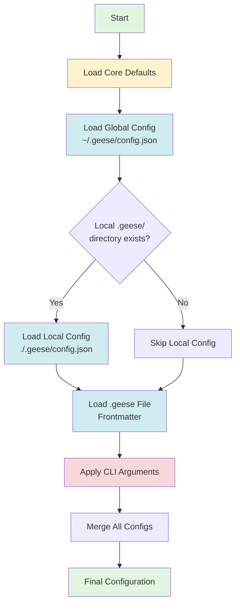
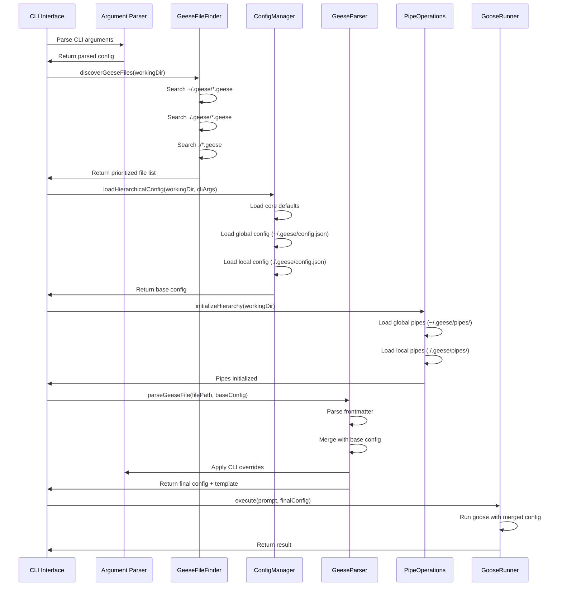

## 📋 Overview

This document outlines a comprehensive hierarchical configuration and pipe inheritance system for Geese. The system provides a flexible, layered approach to configuration management where settings cascade from core defaults through multiple levels to command-line overrides.

## 🎯 Goals

1. **Hierarchical Configuration**: Support multiple configuration levels that override each other in a predictable order
2. **Pipe Inheritance**: Allow custom pipe operations to be defined at multiple levels with local overrides
3. **Command-Line Flexibility**: Enable runtime configuration overrides via CLI arguments
4. **Backward Compatibility**: Maintain compatibility with existing configuration files
5. **Clarity**: Make it clear which configuration values are being used and from which source

## 🏗️ Architecture

### Configuration Hierarchy

The system implements a 4-level configuration hierarchy:

```
┌─────────────────────────────────────────────────────────────┐
│                    Command Line Arguments                    │
│                  (Highest Priority - Level 4)                │
│               --model gpt-4 --temperature 0.8                │
└─────────────────────────────────────────────────────────────┘
                              ↓ Overrides
┌─────────────────────────────────────────────────────────────┐
│                    .geese File Properties                    │
│                         (Level 3)                            │
│              Located: ./path/to/recipe.geese                 │
│         $model: gpt-4, custom_prop: value, etc.              │
└─────────────────────────────────────────────────────────────┘
                              ↓ Overrides
┌─────────────────────────────────────────────────────────────┐
│              Local Directory Configuration                   │
│                         (Level 2)                            │
│              Located: ./.geese/config.json                   │
│        Project-specific settings and preferences             │
└─────────────────────────────────────────────────────────────┘
                              ↓ Overrides
┌─────────────────────────────────────────────────────────────┐
│              Global/Profile Configuration                    │
│                         (Level 1)                            │
│             Located: ~/.geese/config.json                    │
│         User-wide defaults and preferences                   │
└─────────────────────────────────────────────────────────────┘
                              ↓ Overrides
┌─────────────────────────────────────────────────────────────┐
│                   Core Default Configuration                 │
│                  (Lowest Priority - Level 0)                 │
│              Hardcoded defaults in application               │
└─────────────────────────────────────────────────────────────┘
```

### Configuration Loading Process



### Pipe Operations Inheritance

Pipe operations follow a similar inheritance pattern:

```
┌─────────────────────────────────────────────────────────────┐
│              Local Directory Custom Pipes                    │
│                  (Highest Priority)                          │
│              Located: ./.geese/pipes/*.js                    │
│         Project-specific pipe operations                     │
└─────────────────────────────────────────────────────────────┘
                              ↓ Overrides
┌─────────────────────────────────────────────────────────────┐
│              Global/Profile Custom Pipes                     │
│                         (Level 1)                            │
│             Located: ~/.geese/pipes/*.js                     │
│         User-wide custom pipe operations                     │
└─────────────────────────────────────────────────────────────┘
                              ↓ Overrides
┌─────────────────────────────────────────────────────────────┐
│                   Built-in Pipe Operations                   │
│                  (Lowest Priority)                           │
│        Core operations (trim, split, readFile, etc.)         │
└─────────────────────────────────────────────────────────────┘
```

## 📁 File System Structure

### Directory Layout

```
User Home Directory (~/)
└── .geese/                         # Global configuration directory
    ├── config.json                 # Global configuration
    ├── pipes/                      # Global custom pipes
    │   ├── customPipe1.js
    │   └── customPipe2.js
    └── *.geese                     # Global .geese recipe files (optional)
        ├── code-review.geese
        └── documentation.geese

Project Directory (./project/)
├── .geese/                         # Local/project configuration
│   ├── config.json                 # Local configuration (optional)
│   ├── pipes/                      # Local custom pipes (optional)
│   │   ├── projectPipe1.js
│   │   └── projectPipe2.js
│   └── *.geese                     # Local .geese recipe files (recommended)
│       ├── code-review.geese
│       └── documentation.geese
│
├── *.geese                         # Root-level .geese files (legacy/fallback)
│   └── quick-review.geese
│
└── src/                            # Source files to process
    └── *.js
```

### .geese File Discovery Order

When running `geese`, files are discovered and processed in this order:

1. **Global**: `~/.geese/*.geese` (user-wide templates, lowest priority)
2. **Local**: `./.geese/*.geese` (project-specific, recommended location)
3. **Root**: `./*.geese` (legacy/convenience, highest priority)

**Note**: By default, `geese new` creates files in `./.geese/` to avoid polluting the project root directory. However, files in all three locations are discovered and available for processing.

## 🔧 Implementation Details

### 1. Enhanced ConfigManager Class

The `ConfigManager` class needs to be extended to support hierarchical configuration loading:

```javascript
// src/config-manager.js (Enhanced)

const fs = require('fs-extra');
const path = require('path');
const os = require('os');

class ConfigManager {
  constructor() {
    this.globalConfigDir = path.join(os.homedir(), '.geese');
    this.globalConfigFile = path.join(this.globalConfigDir, 'config.json');
  }

  /**
   * Get the local configuration directory for a given path
   * Walks up the directory tree to find .geese directory
   * @param {string} startPath - Starting directory path
   * @returns {string|null} Path to local .geese directory or null
   */
  getLocalConfigDir(startPath) {
    let currentDir = path.resolve(startPath);
    const root = path.parse(currentDir).root;

    while (currentDir !== root) {
      const geeseDir = path.join(currentDir, '.geese');
      if (fs.existsSync(geeseDir)) {
        return geeseDir;
      }
      currentDir = path.dirname(currentDir);
    }

    return null;
  }

  /**
   * Load configuration from a specific file
   * @param {string} configPath - Path to config file
   * @returns {Object} Configuration object
   */
  async loadConfigFile(configPath) {
    try {
      if (await fs.pathExists(configPath)) {
        const content = await fs.readFile(configPath, 'utf8');
        return JSON.parse(content);
      }
      return {};
    } catch (error) {
      console.warn(`Warning: Could not load config from ${configPath}: ${error.message}`);
      return {};
    }
  }

  /**
   * Get core default configuration
   * These are the hardcoded defaults built into the application
   * @returns {Object} Core default configuration
   */
  getCoreDefaults() {
    return {
      goose: {
        model: 'gpt-4',
        temperature: 0.7,
        max_tokens: 2000,
        recipe: 'default',
        include: ['**/*.js'],
        exclude: ['node_modules/**', '*.test.js', 'dist/**']
      },
      defaultTool: 'goose',
      logLevel: 'info'
    };
  }

  /**
   * Load hierarchical configuration
   * Merges configurations from all levels in order of priority
   * @param {string} workingDir - Current working directory
   * @param {string} geeseFile - Path to .geese file (optional)
   * @param {Object} cliArgs - Command line arguments (optional)
   * @returns {Object} Merged configuration with metadata
   */
  async loadHierarchicalConfig(workingDir, geeseFile = null, cliArgs = {}) {
    const sources = {};

    // Level 0: Core defaults
    const coreDefaults = this.getCoreDefaults();
    sources.core = coreDefaults;

    // Level 1: Global configuration
    const globalConfig = await this.loadConfigFile(this.globalConfigFile);
    sources.global = globalConfig;

    // Level 2: Local directory configuration
    let localConfig = {};
    const localConfigDir = this.getLocalConfigDir(workingDir);
    if (localConfigDir) {
      const localConfigFile = path.join(localConfigDir, 'config.json');
      localConfig = await this.loadConfigFile(localConfigFile);
      sources.local = localConfig;
      sources.localConfigDir = localConfigDir;
    }

    // Level 3: .geese file configuration
    let geeseFileConfig = {};
    if (geeseFile) {
      // This will be extracted from the .geese file frontmatter
      // by the GeeseParser, so we just note its path here
      sources.geeseFile = geeseFile;
    }

    // Level 4: Command line arguments
    sources.cli = cliArgs;

    // Deep merge all configurations
    const merged = this.deepMerge(
      coreDefaults,
      globalConfig,
      localConfig,
      geeseFileConfig,
      cliArgs
    );

    return {
      config: merged,
      sources: sources,
      hierarchy: ['core', 'global', 'local', 'geese', 'cli']
    };
  }

  /**
   * Deep merge multiple configuration objects
   * Later objects override earlier ones
   * @param {...Object} configs - Configuration objects to merge
   * @returns {Object} Merged configuration
   */
  deepMerge(...configs) {
    const result = {};

    for (const config of configs) {
      for (const key in config) {
        if (Object.prototype.hasOwnProperty.call(config, key)) {
          const value = config[key];

          if (value && typeof value === 'object' && !Array.isArray(value)) {
            // Recursively merge objects
            result[key] = this.deepMerge(result[key] || {}, value);
          } else {
            // Override with new value (includes arrays)
            result[key] = value;
          }
        }
      }
    }

    return result;
  }

  /**
   * Get configuration value with source tracking
   * @param {Object} hierarchicalConfig - Result from loadHierarchicalConfig
   * @param {string} key - Configuration key (dot notation)
   * @returns {Object} Value and source information
   */
  getWithSource(hierarchicalConfig, key) {
    const { config, sources, hierarchy } = hierarchicalConfig;

    // Get the actual value
    const value = this.getNestedValue(config, key);

    // Find which source provided this value
    let source = 'core';
    for (let i = hierarchy.length - 1; i >= 0; i--) {
      const sourceName = hierarchy[i];
      const sourceConfig = sources[sourceName];
      if (sourceConfig && this.hasNestedValue(sourceConfig, key)) {
        source = sourceName;
        break;
      }
    }

    return {
      value,
      source,
      key
    };
  }

  /**
   * Get nested value from object using dot notation
   * @param {Object} obj - Object to search
   * @param {string} key - Key in dot notation (e.g., 'goose.model')
   * @returns {*} Value or undefined
   */
  getNestedValue(obj, key) {
    const keys = key.split('.');
    let current = obj;

    for (const k of keys) {
      if (current && typeof current === 'object' && k in current) {
        current = current[k];
      } else {
        return undefined;
      }
    }

    return current;
  }

  /**
   * Check if object has nested key
   * @param {Object} obj - Object to check
   * @param {string} key - Key in dot notation
   * @returns {boolean}
   */
  hasNestedValue(obj, key) {
    return this.getNestedValue(obj, key) !== undefined;
  }

  /**
   * Create local configuration directory
   * @param {string} projectDir - Project directory path
   */
  async createLocalConfig(projectDir) {
    const localConfigDir = path.join(projectDir, '.geese');
    const localConfigFile = path.join(localConfigDir, 'config.json');

    await fs.ensureDir(localConfigDir);

    if (!(await fs.pathExists(localConfigFile))) {
      const defaultLocalConfig = {
        // Project-specific defaults
        goose: {
          // Will inherit from global, can override here
        }
      };

      await fs.writeFile(
        localConfigFile,
        JSON.stringify(defaultLocalConfig, null, 2),
        'utf8'
      );
    }

    return localConfigDir;
  }

  // ... existing methods (loadConfig, saveConfig, get, set, etc.) remain unchanged
}

module.exports = ConfigManager;
```

### 2. Enhanced Pipe Operations with Inheritance

```javascript
// src/pipe-operations.js (Enhanced)

const fs = require('fs-extra');
const path = require('path');
const os = require('os');

class PipeOperations {
  constructor() {
    this.operations = new Map();
    this.builtinOperations = new Set();
    this.operationSources = new Map(); // Track where each operation came from
    this.registerBuiltinOperations();
  }

  /**
   * Initialize pipe operations with hierarchical loading
   * @param {string} workingDir - Current working directory
   */
  async initializeHierarchy(workingDir) {
    // Built-in operations are already loaded

    // Load global custom pipes
    const globalPipesDir = path.join(os.homedir(), '.geese', 'pipes');
    await this.loadCustomPipesFromDirectory(globalPipesDir, 'global');

    // Load local custom pipes
    const localGeeseDir = this.findLocalGeeseDir(workingDir);
    if (localGeeseDir) {
      const localPipesDir = path.join(localGeeseDir, 'pipes');
      await this.loadCustomPipesFromDirectory(localPipesDir, 'local');
    }
  }

  /**
   * Find local .geese directory by walking up the tree
   * @param {string} startPath - Starting directory
   * @returns {string|null} Path to .geese directory or null
   */
  findLocalGeeseDir(startPath) {
    let currentDir = path.resolve(startPath);
    const root = path.parse(currentDir).root;

    while (currentDir !== root) {
      const geeseDir = path.join(currentDir, '.geese');
      if (fs.existsSync(geeseDir)) {
        return geeseDir;
      }
      currentDir = path.dirname(currentDir);
    }

    return null;
  }

  /**
   * Load custom pipes from a directory
   * @param {string} pipesDir - Directory containing pipe files
   * @param {string} source - Source identifier ('global' or 'local')
   */
  async loadCustomPipesFromDirectory(pipesDir, source) {
    if (!(await fs.pathExists(pipesDir))) {
      return;
    }

    const files = await fs.readdir(pipesDir);

    for (const file of files) {
      if (file.endsWith('.js')) {
        const pipePath = path.join(pipesDir, file);
        try {
          // Clear require cache to allow reloading
          delete require.cache[require.resolve(pipePath)];

          const pipeName = this.loadCustomPipe(pipePath);
          this.operationSources.set(pipeName, source);

          console.log(`Loaded ${source} pipe: ${pipeName}`);
        } catch (error) {
          console.warn(`Warning: Failed to load pipe ${file} from ${source}: ${error.message}`);
        }
      }
    }
  }

  /**
   * Register a pipe operation with source tracking
   * @param {string} name - Operation name
   * @param {Function} fn - Operation function
   * @param {boolean} isBuiltin - Whether this is a built-in operation
   */
  register(name, fn, isBuiltin = false) {
    const existingSource = this.operationSources.get(name);

    if (isBuiltin) {
      this.builtinOperations.add(name);
      this.operationSources.set(name, 'builtin');
    } else if (this.builtinOperations.has(name)) {
      console.warn(`Warning: Custom pipe "${name}" overrides built-in operation`);
    } else if (existingSource) {
      // Local pipes override global pipes
      if (existingSource === 'global') {
        console.log(`Local pipe "${name}" overrides global pipe`);
      }
    }

    this.operations.set(name, fn);
  }

  /**
   * Get information about a pipe operation
   * @param {string} name - Operation name
   * @returns {Object} Pipe information
   */
  getPipeInfo(name) {
    return {
      name,
      exists: this.has(name),
      source: this.operationSources.get(name) || 'unknown',
      isBuiltin: this.builtinOperations.has(name)
    };
  }

  /**
   * List all operations with their sources
   * @returns {Array} Array of operation info objects
   */
  listWithSources() {
    const operations = [];

    for (const name of this.operations.keys()) {
      operations.push(this.getPipeInfo(name));
    }

    return operations;
  }

  // ... existing methods remain unchanged
}

module.exports = new PipeOperations();
```

### 3. CLI Argument Parser Enhancement

```javascript
// src/cli-argument-parser.js (New File)

/**
 * Parse command-line arguments and convert them to configuration overrides
 * Supports both --key value and --key=value formats
 */
class CLIArgumentParser {
  /**
   * Parse CLI arguments into configuration object
   * @param {Array} args - Process arguments array
   * @returns {Object} Configuration object
   */
  static parseToConfig(args) {
    const config = {};

    for (let i = 0; i < args.length; i++) {
      const arg = args[i];

      // Skip if not an option
      if (!arg.startsWith('--')) {
        continue;
      }

      // Remove -- prefix
      let key = arg.substring(2);
      let value;

      // Check for --key=value format
      if (key.includes('=')) {
        const parts = key.split('=');
        key = parts[0];
        value = parts.slice(1).join('=');
      } else {
        // Check for --key value format
        if (i + 1 < args.length && !args[i + 1].startsWith('--')) {
          value = args[i + 1];
          i++; // Skip next argument
        } else {
          // Boolean flag
          value = true;
        }
      }

      // Convert key to nested object structure
      // e.g., 'goose.model' becomes { goose: { model: value } }
      this.setNestedValue(config, key, this.parseValue(value));
    }

    return config;
  }

  /**
   * Set nested value in object using dot notation
   * @param {Object} obj - Object to modify
   * @param {string} key - Key in dot notation
   * @param {*} value - Value to set
   */
  static setNestedValue(obj, key, value) {
    const keys = key.split('.');
    let current = obj;

    for (let i = 0; i < keys.length - 1; i++) {
      const k = keys[i];
      if (!(k in current)) {
        current[k] = {};
      }
      current = current[k];
    }

    current[keys[keys.length - 1]] = value;
  }

  /**
   * Parse value to appropriate type
   * @param {string} value - String value
   * @returns {*} Parsed value
   */
  static parseValue(value) {
    // Boolean
    if (value === 'true') return true;
    if (value === 'false') return false;

    // Number
    if (/^-?\d+$/.test(value)) {
      return parseInt(value, 10);
    }
    if (/^-?\d+\.\d+$/.test(value)) {
      return parseFloat(value);
    }

    // JSON array or object
    if (value.startsWith('[') || value.startsWith('{')) {
      try {
        return JSON.parse(value);
      } catch (e) {
        // Not valid JSON, return as string
      }
    }

    // String
    return value;
  }

  /**
   * Generate help text for configuration options
   * @returns {string} Help text
   */
  static getConfigHelp() {
    return `
Configuration Options:
  --model <name>              AI model to use (e.g., gpt-4, claude-3)
  --temperature <number>      Temperature for AI responses (0.0-1.0)
  --max-tokens <number>       Maximum tokens in response
  --recipe <name>             Recipe name to use
  --goose.model <name>        Tool-specific model (nested config)

Examples:
  geese run --model gpt-4 --temperature 0.8
  geese run --goose.model claude-3 --goose.temperature 0.5
  geese run -f review.geese --model gpt-4
`;
  }
}

module.exports = CLIArgumentParser;
```

### 4. Enhanced GeeseParser Integration

```javascript
// src/geese-parser.js (Enhanced parseGeeseFile method)

/**
 * Parse a .geese file with hierarchical configuration
 * @param {string} filePath - Path to the .geese file
 * @param {Object} baseConfig - Base configuration from hierarchy
 * @returns {Object} Parsed content with merged configuration
 */
parseGeeseFile(filePath, baseConfig = {}) {
  try {
    let fileContent = fs.readFileSync(filePath, 'utf8');

    // Existing preprocessing...
    fileContent = this.preprocessPipeOperations(fileContent);

    const parsed = matter(fileContent);

    // Separate system properties ($) from user properties
    const systemProps = {};
    const userProps = {};

    for (const [key, value] of Object.entries(parsed.data)) {
      if (key.startsWith('$')) {
        systemProps[key.substring(1)] = value; // Remove $ prefix
      } else {
        userProps[key] = value;
      }
    }

    // Merge base config with .geese file system properties
    const mergedConfig = this.deepMerge(baseConfig, systemProps);

    return {
      config: mergedConfig,        // Merged system configuration
      properties: userProps,        // User properties for templates
      template: parsed.content,
      filePath: filePath,
      filename: path.basename(filePath, '.geese'),
      fileDir: path.dirname(filePath)
    };
  } catch (error) {
    throw new Error(`Failed to parse .geese file ${filePath}: ${error.message}`);
  }
}
```

### 5. .geese File Discovery

```javascript
// src/geese-file-finder.js (New File)

const fs = require('fs-extra');
const path = require('path');
const os = require('os');
const glob = require('glob');

class GeeseFileFinder {
  /**
   * Discover .geese files in hierarchical order
   * @param {string} workingDir - Current working directory
   * @returns {Array} Array of .geese file paths in priority order
   */
  async discoverGeeseFiles(workingDir) {
    const files = [];

    // 1. Global .geese files (~/.geese/*.geese)
    const globalGeeseDir = path.join(os.homedir(), '.geese');
    if (await fs.pathExists(globalGeeseDir)) {
      const globalFiles = await this.findGeeseInDirectory(globalGeeseDir);
      files.push(...globalFiles.map(f => ({
        path: f,
        source: 'global',
        priority: 1
      })));
    }

    // 2. Local .geese files (./.geese/*.geese)
    const localGeeseDir = path.join(workingDir, '.geese');
    if (await fs.pathExists(localGeeseDir)) {
      const localFiles = await this.findGeeseInDirectory(localGeeseDir);
      files.push(...localFiles.map(f => ({
        path: f,
        source: 'local',
        priority: 2
      })));
    }

    // 3. Root .geese files (./*.geese)
    const rootFiles = await this.findGeeseInDirectory(workingDir, false);
    files.push(...rootFiles.map(f => ({
      path: f,
      source: 'root',
      priority: 3
    })));

    // Remove duplicates (same filename, keep highest priority)
    const uniqueFiles = this.deduplicateByName(files);

    return uniqueFiles;
  }

  /**
   * Find .geese files in a specific directory
   * @param {string} dir - Directory to search
   * @param {boolean} recursive - Search subdirectories (default: true)
   * @returns {Array} Array of file paths
   */
  async findGeeseInDirectory(dir, recursive = true) {
    const pattern = recursive
      ? path.join(dir, '**/*.geese')
      : path.join(dir, '*.geese');

    return new Promise((resolve, reject) => {
      glob(pattern, {
        ignore: ['**/node_modules/**', '**/dist/**'],
        nodir: true
      }, (err, files) => {
        if (err) reject(err);
        else resolve(files);
      });
    });
  }

  /**
   * Remove duplicate files by name, keeping highest priority
   * @param {Array} files - Array of file objects with path, source, priority
   * @returns {Array} Deduplicated array
   */
  deduplicateByName(files) {
    const fileMap = new Map();

    for (const file of files) {
      const basename = path.basename(file.path);
      const existing = fileMap.get(basename);

      if (!existing || file.priority > existing.priority) {
        fileMap.set(basename, file);
      }
    }

    return Array.from(fileMap.values())
      .sort((a, b) => a.priority - b.priority)
      .map(f => f.path);
  }

  /**
   * Get the default output directory for new .geese files
   * @param {string} workingDir - Current working directory
   * @param {string} outputDir - Custom output directory (optional)
   * @returns {string} Path to output directory
   */
  getDefaultOutputDir(workingDir, outputDir = null) {
    if (outputDir) {
      return path.resolve(workingDir, outputDir);
    }

    // Default to .geese directory to avoid polluting root
    return path.join(workingDir, '.geese');
  }

  /**
   * Ensure .geese directory exists
   * @param {string} workingDir - Working directory
   */
  async ensureGeeseDirectory(workingDir) {
    const geeseDir = path.join(workingDir, '.geese');
    await fs.ensureDir(geeseDir);
    return geeseDir;
  }
}

module.exports = new GeeseFileFinder();
```

## 📊 Configuration Flow Diagram

### Complete Request Flow



## 🔍 Configuration Resolution Examples

### Example 1: Basic Override Chain

**Core Defaults:**
```javascript
{
  goose: {
    model: 'gpt-4',
    temperature: 0.7,
    max_tokens: 2000
  }
}
```

**Global Config (`~/.geese/config.json`):**
```json
{
  "goose": {
    "model": "claude-3",
    "temperature": 0.5
  }
}
```

**Local Config (`./.geese/config.json`):**
```json
{
  "goose": {
    "temperature": 0.8,
    "recipe": "code-review"
  }
}
```

**.geese File:**
```yaml
---
$model: gpt-4-turbo
$max_tokens: 4000
---
```

**CLI Arguments:**
```bash
geese run --temperature 0.9
```

**Final Resolved Configuration:**
```javascript
{
  goose: {
    model: 'gpt-4-turbo',      // From .geese file
    temperature: 0.9,           // From CLI (highest priority)
    max_tokens: 4000,           // From .geese file
    recipe: 'code-review'       // From local config
  }
}
```

### Example 2: Pipe Operations Override

**Built-in Pipes:**
- `trim`, `toUpperCase`, `split`, etc.

**Global Custom Pipe (`~/.geese/pipes/formatName.js`):**
```javascript
module.exports = function formatName(value, args, context) {
  return value.split(' ').map(word =>
    word.charAt(0).toUpperCase() + word.slice(1).toLowerCase()
  ).join(' ');
};
```

**Local Custom Pipe (`./.geese/pipes/formatName.js`):**
```javascript
module.exports = function formatName(value, args, context) {
  // Project-specific name formatting
  return value.toUpperCase().replace(/\s+/g, '_');
};
```

**Usage in .geese file:**
```yaml
---
author_name: john doe ~> formatName
# Will use LOCAL version: "JOHN_DOE"
# If local didn't exist, would use GLOBAL version: "John Doe"
---
```

## 🎨 Visual Configuration Inspector

### Debug Output Example

When running with a `--debug-config` flag, users can see the complete configuration hierarchy:

```
┌─────────────────────────────────────────────────────────────┐
│               Configuration Resolution Report                │
└─────────────────────────────────────────────────────────────┘

Working Directory: /home/user/my-project
.geese File: ./.geese/code-review.geese

┌─────────────────────────────────────────────────────────────┐
│  Property: goose.model                                       │
├─────────────────────────────────────────────────────────────┤
│  Core Default:       gpt-4                                   │
│  Global Config:      claude-3              [OVERRIDE]        │
│  Local Config:       (not set)                               │
│  .geese File:        gpt-4-turbo           [OVERRIDE]        │
│  CLI Argument:       (not set)                               │
├─────────────────────────────────────────────────────────────┤
│  ✓ Final Value:      gpt-4-turbo                             │
│  ✓ Source:           .geese file                             │
└─────────────────────────────────────────────────────────────┘

┌─────────────────────────────────────────────────────────────┐
│  Property: goose.temperature                                 │
├─────────────────────────────────────────────────────────────┤
│  Core Default:       0.7                                     │
│  Global Config:      0.5                   [OVERRIDE]        │
│  Local Config:       0.8                   [OVERRIDE]        │
│  .geese File:        (not set)                               │
│  CLI Argument:       0.9                   [OVERRIDE]        │
├─────────────────────────────────────────────────────────────┤
│  ✓ Final Value:      0.9                                     │
│  ✓ Source:           CLI argument                            │
└─────────────────────────────────────────────────────────────┘

Available Pipe Operations:
  [B] trim              (built-in)
  [B] toUpperCase       (built-in)
  [G] formatName        (global custom)
  [L] projectSpecific   (local custom - overrides global if exists)

Legend: [B] = Built-in, [G] = Global, [L] = Local
```

## 🛠️ CLI Enhancements

### New Command Options

```bash
# Create a new .geese file (defaults to .geese/ directory)
geese new code-review

# Create a new .geese file in specific location
geese new code-review -o ./

# Show configuration hierarchy without running
geese config inspect [directory]

# Show effective configuration for a .geese file
geese config show -f .geese/code-review.geese

# Create local configuration
geese config init-local [directory]

# List all pipes with sources
geese pipe list --sources

# Run with configuration override
geese run -f .geese/review.geese --model gpt-4 --temperature 0.9

# Debug configuration resolution
geese run --debug-config
```

### Updated Help Text

```
Configuration System:

  Geese uses a hierarchical configuration system with 4 levels:

  1. Core Defaults     - Built-in application defaults
  2. Global Config     - ~/.geese/config.json (user-wide)
  3. Local Config      - ./.geese/config.json (project-specific)
  4. CLI Arguments     - Command-line overrides (highest priority)

  Each level overrides values from lower levels. Properties not
  specified at a level are inherited from the level below.

.geese File Discovery:

  Files are discovered in this order (last wins if same name):
  1. Global: ~/.geese/*.geese
  2. Local:  ./.geese/*.geese (recommended, created by default)
  3. Root:   ./*.geese (legacy/convenience)

Examples:

  # Create a new .geese file (goes to .geese/ by default)
  geese new code-review

  # Use global config
  geese run

  # Override with CLI arguments
  geese run --model claude-3 --temperature 0.8

  # Show configuration without running
  geese config show -f .geese/review.geese

  # Initialize local project config
  geese config init-local

See 'geese config --help' for configuration management commands.
```

## 📝 Migration Guide

### For Existing Users

1. **No Breaking Changes**: Existing configurations continue to work
2. **Opt-in Local Config**: Create `./.geese/config.json` only if needed
3. **Pipe Compatibility**: Existing global pipes work unchanged
4. **CLI Args**: New override capability doesn't affect existing scripts

### Upgrading from Current System

```bash
# Step 1: Your existing global config still works
cat ~/.geese/config.json

# Step 2: Optionally create local project config
cd /path/to/project
geese config init-local

# Step 3: Add project-specific settings
geese config --set goose.recipe my-recipe --local

# Step 4: Use CLI overrides when needed
geese run --model gpt-4-turbo
```

## 🧪 Testing Strategy

### Unit Tests

```javascript
// tests/config-manager.test.js

describe('ConfigManager Hierarchy', () => {
  it('should merge configurations in correct order', async () => {
    const cm = new ConfigManager();
    const config = await cm.loadHierarchicalConfig(
      '/test/project',
      '/test/project/test.geese',
      { goose: { model: 'cli-model' } }
    );

    expect(config.config.goose.model).toBe('cli-model');
  });

  it('should track configuration sources', async () => {
    const cm = new ConfigManager();
    const config = await cm.loadHierarchicalConfig('/test/project');
    const info = cm.getWithSource(config, 'goose.model');

    expect(info.source).toMatch(/core|global|local/);
  });
});

describe('GeeseFileFinder', () => {
  it('should discover files in correct order', async () => {
    const finder = require('./geese-file-finder');
    const files = await finder.discoverGeeseFiles('/test/project');

    // Should have files from all three locations
    expect(files.length).toBeGreaterThan(0);
  });

  it('should deduplicate files by name, keeping highest priority', async () => {
    // Setup: create same filename in multiple locations
    const finder = require('./geese-file-finder');
    const files = await finder.discoverGeeseFiles('/test/project');

    // Should only have one instance of each filename
    const names = files.map(f => path.basename(f));
    expect(names.length).toBe(new Set(names).size);
  });

  it('should default new files to .geese directory', () => {
    const finder = require('./geese-file-finder');
    const outputDir = finder.getDefaultOutputDir('/test/project');

    expect(outputDir).toBe('/test/project/.geese');
  });
});

describe('PipeOperations Hierarchy', () => {
  it('should load global pipes before local', async () => {
    const po = new PipeOperations();
    await po.initializeHierarchy('/test/project');

    const info = po.getPipeInfo('customPipe');
    expect(info.source).toBe('global');
  });

  it('should allow local pipes to override global', async () => {
    const po = new PipeOperations();
    // Setup: create both global and local versions
    await po.initializeHierarchy('/test/project');

    const info = po.getPipeInfo('customPipe');
    expect(info.source).toBe('local');
  });
});
```

### Integration Tests

```javascript
// tests/integration/hierarchy.test.js

describe('End-to-End Configuration', () => {
  it('should resolve complete hierarchy', async () => {
    // Setup: create config files at all levels
    // Run: execute geese with CLI args
    // Verify: correct values are used
  });

  it('should use local pipes over global', async () => {
    // Setup: create same pipe at both levels
    // Run: process .geese file using the pipe
    // Verify: local version is executed
  });

  it('should discover .geese files in correct priority order', async () => {
    // Setup: create same-named .geese file in all three locations
    // Run: discover files
    // Verify: root version takes priority over local over global
  });

  it('should create new .geese files in .geese directory by default', async () => {
    // Setup: run geese new command without -o flag
    // Verify: file created in ./.geese/ directory
  });

  it('should allow creating .geese files in custom location with -o flag', async () => {
    // Setup: run geese new command with -o ./custom
    // Verify: file created in ./custom/ directory
  });
});
```

## 📚 Documentation Updates

### Files to Update

1. **README.md**: ✅ Already includes hierarchical configuration section
2. **FEATURES_OVERVIEW.md**: ✅ Comprehensive feature documentation
3. **pipe-operations.md**: ✅ Complete pipe operations guide with inheritance
4. **examples/**: Add example configurations at each level

### New Documentation Files

1. **docs/configuration-system.md**: Complete system documentation
2. **docs/migration-guide.md**: Upgrade instructions
3. **docs/best-practices.md**: Configuration best practices

## ✅ Implementation Checklist

### Phase 1: Core Infrastructure
- [ ] Enhance `ConfigManager` class with hierarchy support
- [ ] Add `getLocalConfigDir()` method
- [ ] Implement `loadHierarchicalConfig()` method
- [ ] Add `deepMerge()` utility
- [ ] Implement `getWithSource()` for debugging

### Phase 2: File Discovery
- [ ] Create `GeeseFileFinder` class
- [ ] Implement `discoverGeeseFiles()` for hierarchical discovery
- [ ] Add `getDefaultOutputDir()` to default to `.geese/` directory
- [ ] Implement `ensureGeeseDirectory()` helper
- [ ] Update `geese new` command to use `.geese/` as default

### Phase 3: Pipe Operations Enhancement
- [ ] Add `initializeHierarchy()` to `PipeOperations`
- [ ] Implement `loadCustomPipesFromDirectory()`
- [ ] Add source tracking for operations
- [ ] Add `listWithSources()` method

### Phase 4: CLI Integration
- [ ] Create `CLIArgumentParser` class
- [ ] Add CLI argument parsing to config
- [ ] Update `bin/geese.js` to use hierarchy
- [ ] Add `--debug-config` flag

### Phase 5: Commands
- [ ] Add `config inspect` command
- [ ] Add `config show` command
- [ ] Add `config init-local` command
- [ ] Update `pipe list` with source info
- [ ] Update `geese new` to accept `-o` flag for custom output

### Phase 6: Testing
- [ ] Unit tests for `ConfigManager`
- [ ] Unit tests for `GeeseFileFinder`
- [ ] Unit tests for `PipeOperations`
- [ ] Unit tests for `CLIArgumentParser`
- [ ] Integration tests for file discovery order
- [ ] Integration tests for full hierarchy
- [ ] Manual testing with real projects

### Phase 7: Documentation
- [x] Update README.md (includes hierarchical configuration)
- [x] Create feature documentation (FEATURES_OVERVIEW.md)
- [x] Update pipe operations documentation (pipe-operations.md)
- [ ] Create migration guide
- [ ] Add inline code documentation
- [ ] Create example configurations

### Phase 8: Polish
- [ ] Add configuration validation
- [ ] Add helpful error messages
- [ ] Create visual config inspector
- [ ] Add backward compatibility warnings
- [ ] Performance optimization

## 🚀 Future Enhancements

### V2.0 Features
1. **Remote Configuration**: Load config from URLs
2. **Environment Variables**: Support `GEESE_*` env vars
3. **Configuration Profiles**: Switch between predefined profiles
4. **Schema Validation**: JSON schema for config files
5. **Configuration Import**: Import/export configurations

### Advanced Features
1. **Conditional Configuration**: Load config based on conditions
2. **Configuration Templates**: Pre-built config sets
3. **Configuration Diff**: Compare configurations
4. **Configuration History**: Track changes over time
5. **Encrypted Configurations**: Secure sensitive settings

## 📞 Support and Feedback

- Report issues on GitHub
- Join community discussions
- Submit feature requests
- Contribute improvements

## 📄 License

This feature implementation follows the project's ISC License.

---

**Document Version**: 1.0
**Created**: 2024-12-02
**Last Updated**: 2024-12-02
**Status**: Proposed Implementation Plan